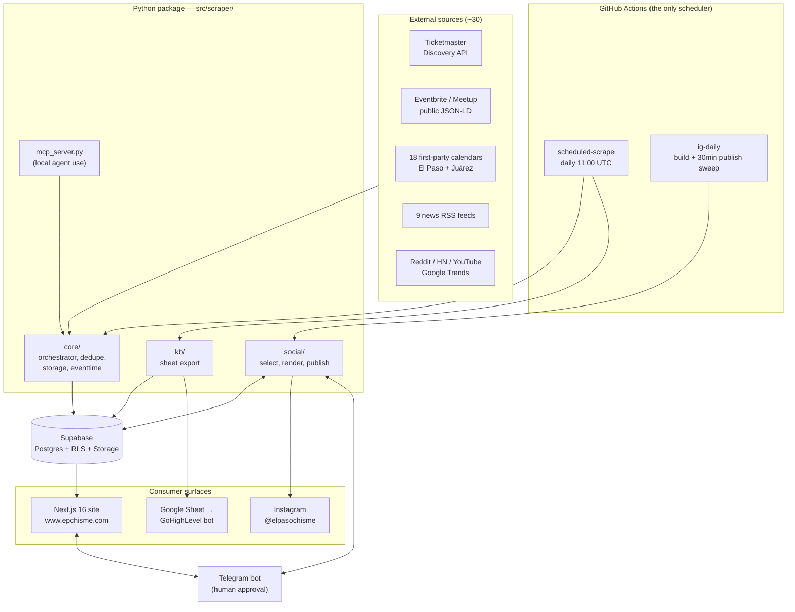
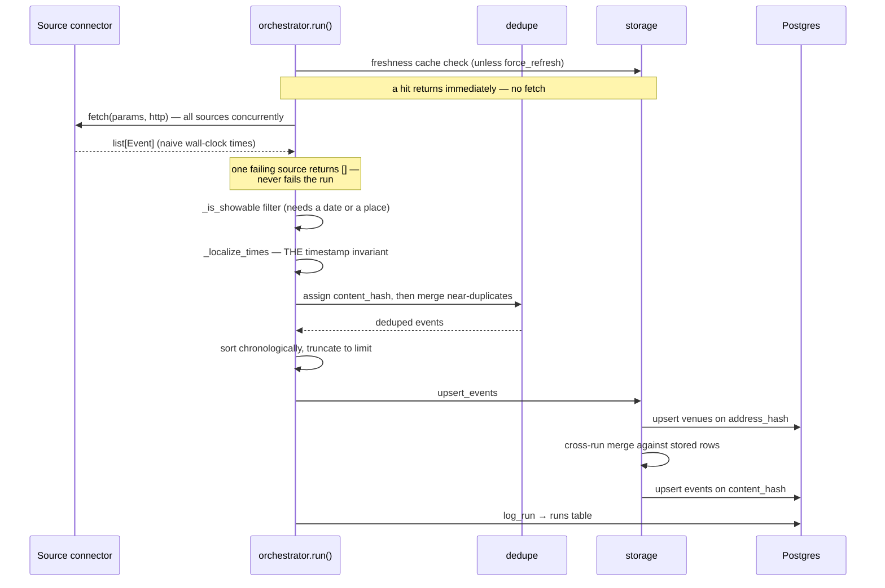
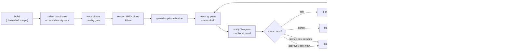

# Architecture Overview

Chisme is four surfaces over one Postgres database. There is no service mesh, no internal API, and
no message queue: **the database is the integration contract**. Understanding that is most of
understanding the architecture.

---

## System context



Two things in that picture are easy to miss and worth stating plainly:

- **GitHub Actions is the only scheduler in the system.** There is no cron in Python, no Vercel cron,
  no Supabase scheduled function. This is deliberate — a second calendar would be a second place to
  get DST wrong, while being invisible from the Actions UI where "never fired" and "fired and
  skipped" look identical (`ig_daily.yml:24-29`).
- **The website participates in the Instagram pipeline.** It hosts the Telegram webhook and the
  token-gated review page, and it can trigger a GitHub workflow run. The approval loop spans both
  languages and both runtimes.

---

## The four surfaces

| Surface | Code | Runtime | Trigger | Doc |
|---|---|---|---|---|
| Data acquisition | `src/scraper/core/`, `src/scraper/sources/` | GitHub Actions, Python 3.12 | Daily cron + manual dispatch | [scraper-engine.md](../components/scraper-engine.md) |
| Social publishing | `src/scraper/social/` | GitHub Actions, Python 3.12 | Chained off the scrape; 30-min publish sweep | [social-pipeline.md](../components/social-pipeline.md) |
| Public website | `web/` | Vercel, Next.js 16 / React 19 | Request-time (all routes dynamic) | [web-app.md](../components/web-app.md) |
| Knowledge-base export | `src/scraper/kb/` | GitHub Actions, Python 3.12 | After every scrape | [knowledge-base-export.md](../components/knowledge-base-export.md) |

Plus one surface that is not deployed anywhere: **`mcp_server.py`** exposes the orchestrator as MCP
tools over stdio for an AI agent running locally. It is a development and research affordance, not
production infrastructure.

---

## How an event travels

The single most useful thing to hold in your head:



Five load-bearing details in that sequence:

1. **Sources emit naive wall-clock times.** Normalisation to aware, event-local timestamps happens
   once, centrally, in `orchestrator._localize_times` — specifically so no future connector can
   reintroduce the bug class it fixes. See [ADR-0002](adr/0002-local-timestamp-invariant.md).
2. **Failure is isolated per source.** `_fetch_one` wraps each `fetch()` and returns an empty list
   on exception (`orchestrator.py:63-70`). A dead source is a partial result, never a failed run.
   This is what makes "every API key is optional" true rather than aspirational.
3. **Dedupe is two-stage.** In-batch (`core/dedupe.py`) catches the same concert scraped from
   Ticketmaster and Eventbrite in one run. Cross-run (`core/storage.py`) catches it appearing on a
   *new* ticketing site next week, and unions the ticket links into the existing row rather than
   creating a second card.
4. **Sort order is chronological, not registration order.** Otherwise a source returning hundreds of
   events crowds every other source out before the `limit` truncation (`orchestrator.py:118-119`).
5. **Write failures are swallowed and logged.** `run()` can report `status: "ok"` with a healthy
   count while nothing reached Postgres. Verify writes from the logs, not the return value.

---

## How a carousel travels



The defining property: **all third-party I/O happens at build time.** By the time `publish` runs,
every slide is a JPEG we own, at exactly the right dimensions, on infrastructure we control — so
the publisher can only fail Meta-side (`social/__init__.py:16-25`). Its corollary is equally
load-bearing: **the caption and slides are frozen at build time.** The publisher must never
regenerate either, or the human would approve something different from what ships.

---

## Repository layout

```
src/scraper/
  core/               models, config, http, storage, dedupe, orchestrator,
                      eventtime, geocode, categorize, address, media, ticket_labels
  sources/            events_*, trends_*, web_*, social_* (+ base, registry, auth_meta)
  social/             selection, render, imaging, caption, publish,
                      notify, telegram, metrics, slides_store
  kb/                 rows, sheets (Google Sheet export)
  mcp_server.py       agent-facing MCP tools
  scheduler.py        the curated recurring jobs
  apply_migration.py  DDL runner (needs SUPABASE_DB_URL)
  backfill_*.py       seven one-off repair scripts

web/                  Next.js 16 app (see components/web-app.md)
supabase/migrations/  0001 … 0010 — the authoritative schema
tests/                kb/ (15), social/ (209), sources/ (15)
assets/fonts/         four static TTFs the renderer requires
docs/                 this directory
graphify-out/         knowledge graph (graph.json, GRAPH_REPORT.md)
.github/workflows/    scheduled_scrape.yml, ig_daily.yml
```

---

## Technology choices, and why

| Choice | Reason it is this and not the obvious alternative |
|---|---|
| Supabase (Postgres) | Postgres with RLS, auth and object storage in one free tier. RLS is what lets the browser write user submissions safely without a backend API. |
| Python for rendering, not `next/og` | Instagram's Content Publishing API **rejects PNG outright**. Satori/`ImageResponse` emits PNG; Pillow encodes JPEG natively (`render.py:3-6`). |
| GitHub Actions, not a worker | The workload is a handful of scheduled minutes a day. Actions is free at this scale and gives logs, manual dispatch and secret storage with no infrastructure. |
| Next.js 16 App Router, all routes dynamic | Every page reads a language cookie, so nothing is statically cacheable anyway. |
| Google Maps over Leaflet | Traded a free tile provider for **deleting hand-maintained mobile-gesture code**. See [ADR-0006](adr/0006-leaflet-to-google-maps.md). |
| A Google Sheet as the bot's knowledge base | GoHighLevel syncs from Sheets natively, and a full rewrite each run means past events stop existing. See [ADR-0010](adr/0010-sheet-export-over-crawler.md). |
| Telegram for approval | Free, instant, has inline buttons and image previews, and the chat itself is the auth boundary — no token or session needed for the common path. |
| No ORM | The Supabase client is used directly. There are no generated `Database` types on the web side, which has consequences — see [web-app.md](../components/web-app.md). |

---

## Boundaries and who owns what

| Concern | Owner | Never done elsewhere |
|---|---|---|
| Timestamp normalisation | `orchestrator._localize_times`, with `storage._iso` as backstop | Not in connectors |
| Identity / dedupe | `core/dedupe.py` (in-batch) + `core/storage.py` (cross-run) | Not in sources; they never compute `content_hash` |
| Moderation status | `events.status`, enforced for the public by RLS policy and for service-role readers by explicit query filters | Never inferred |
| Slide rendering | `social/render.py` + `social/imaging.py` | Never in the web app |
| Publishing to Meta | `social/publish.py` only | The web app only flips a status and fires a dispatch |
| Region scoping | Both layers, independently: source-side in `events_directories`, read-side in `web/src/lib/events.ts` | — |
| Scheduling | `.github/workflows/` cron only | No Python calendar |

The "both layers, independently" row is worth dwelling on. Region scoping is enforced at ingest
*and* at read, because neither alone is sufficient: a source can mislabel an event, and a clamp in
the presentation layer is not a data-scope guarantee. That lesson cost two commits on the same day
— see [ADR-0005](adr/0005-region-restriction-everywhere.md).

---

## What is deliberately absent

Knowing what was *not* built, and why, prevents re-proposing it.

| Absent | Why |
|---|---|
| CI tests / lint / build gate | Nothing runs `pytest`, `ruff` or `npm run build` in CI. This is a **gap, not a decision** — see [known-gaps.md](../known-gaps.md). |
| A backend API for the website | The browser talks to Postgres through PostgREST under RLS. Fewer moving parts; RLS is the enforcement. |
| Logged-in social scraping | Scraping Instagram/Facebook/X through browser sessions violates their terms and breaks constantly. Only official own-account APIs are used. |
| Per-slide metrics | A carousel is one media object; Meta exposes no per-child insight. So a number describes a *post*, never an event. |
| Metrics feeding back into selection | Deliberate, pending signal: reach is 6–10 per post, which is far too little to tune category weights on without fitting noise (`selection.py:345-349`). |
| A "past events" browse mode | Excluded by design; every query sets a lower time bound. |
| pgvector semantic search | Scoped in `0001_init.sql:78-81` and left commented out. |
| A rollback procedure | Not documented anywhere. **Gap.** |

---

## Where to go next

- The rules you must not break: [invariants.md](invariants.md)
- Why things are the way they are: [adr/](adr/)
- The component you are about to touch: [../components/](../components/)

---

*Verified against commit `9157646` (2026-09-06). Last updated 2026-09-10.*
