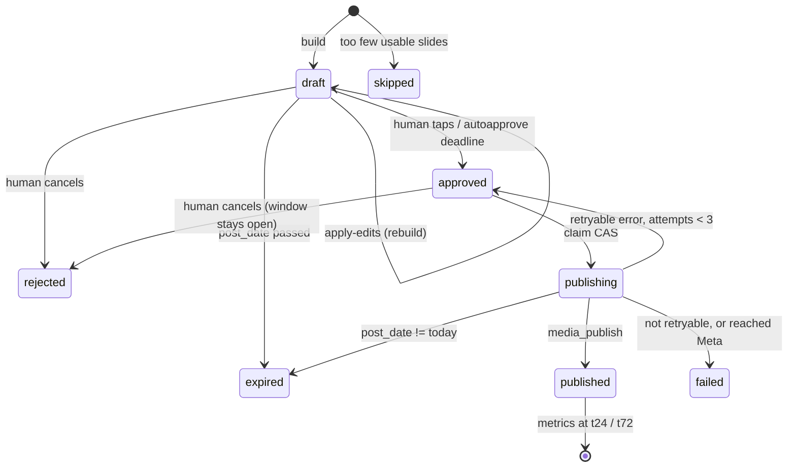

# Component: Social Publishing Pipeline

Turns events already in Supabase into an Instagram carousel, routes it past a human on Telegram, and
publishes it. Owns `src/scraper/social/`, plus the Telegram webhook and review page in the web app —
the approval loop spans both runtimes and is not describable without both.

---

## At a glance

| | |
|---|---|
| **Entry point** | `python -m scraper.social <subcommand>` |
| **Runs on** | GitHub Actions (`ig-daily`): build chained off the scrape; publish sweep every 30 min |
| **Writes** | `ig_posts`, `ig_post_edits`, `ig_post_metrics`, the `ig-slides` storage bucket, Instagram |
| **Requires** | Supabase + `IG_ACCESS_TOKEN` + `IG_BUSINESS_ACCOUNT_ID`; Pillow (`[social]` extra) |
| **Tests** | `tests/social/` — 209 tests, the best-covered part of the codebase |

**The defining property:** all third-party I/O happens at **build** time. By publish time every slide
is a JPEG we own, at the right dimensions, on infrastructure we control — so the publisher can only
fail Meta-side. Its corollary: **the caption and slides are frozen at build time.** The publisher must
never regenerate either, or the human would approve something different from what ships.

---

## Lifecycle of one post



`build` in order (`social/__main__.py:113-276`):

1. Resolve the window for this `kind`, the score profile, and the period key.
2. Read approved events for the window — `storage.query_events_for_range(CITY, …)`.
3. Look up recently-posted slide keys for suppression, with a per-kind lookback.
4. `selection.choose(...)` ranks everything; **the slide cap is applied later**, during the photo loop.
5. Fetch photos in rank order until `IG_MAX_SLIDES` is reached. A dead photo no longer drops the event
   — there is a text-only layout for exactly this case.
6. Below `IG_MIN_SLIDES` → write a `skipped` row and stop.
7. Re-sort **chronologically**, keeping each photo paired with its event.
8. Render cover + event slides; build the caption.
9. `--dry-run` returns here; `--out` also writes JPEGs and `caption.txt` locally.
10. Insert the draft. A `None` return means the partial unique index rejected it because a live post
    already exists — a normal re-run outcome, not an error.
11. Upload slides, record their paths, notify Telegram (and email).
12. If `IG_AUTOPOST`: approve and publish immediately, in the same process.

---

## CLI reference

| Subcommand | Flags | What it does | When it runs |
|---|---|---|---|
| `build` | `--date`, `--dry-run`, `--out DIR`, `--kind` | Select, render, upload, draft, notify | Chained off `scheduled-scrape`; Thursdays for `weekend`; the 1st for `monthly` |
| `publish` | `--date`, `--dry-run` | Claims and ships every approved row whose `scheduled_for` has arrived | Every 30 min across El Paso daytime, and on demand |
| `apply-edits` | `--post-id`, `--dry-run` | Re-renders a draft to satisfy pending edit intents | Dispatched immediately by the webhook **and** unconditionally at the top of every sweep |
| `autoapprove` | `--date`, `--dry-run` | Flips untouched drafts past their deadline; expires stale ones | Step immediately before `publish` |
| `prune` | — | Deletes slide objects older than the retention window | Start of the build job |
| `metrics` | `--dry-run` | Snapshots t24/t72 performance; sends the "how yesterday did" digest | Last step of publish, non-fatal |
| `check-token` | `--min-days N` (14) | `/me` liveness, then expiry if introspectable. Exits 1 on trouble | `preflight`, and again in `build` (non-fatal) |
| `check-telegram` | — | Bot + webhook health. **Exits non-zero** and reports by email | `preflight` |
| `telegram-webhook` | `--set` | Inspect or register the webhook; refuses a redirecting URL | Once at setup, and after a domain change |
| `refresh-token` | — | Extends the long-lived token and **prints** it | Manual rotation inside the ~60-day window |

Three CLI quirks worth knowing:

- `--kind` offers `breaking`, but no cron fires it and the workflow does not list it. **Implemented,
  not scheduled.**
- `prune` is the fall-through default in `main()` rather than an explicit branch. Harmless today, but a
  future subcommand added without a dispatch branch would silently run `prune`.
- `telegram-webhook` returns 1 when problems exist, even without `--set`.

**The command you will use most:**

```bash
python -m scraper.social build --dry-run --out ./_preview
```

Renders everything locally, writes nothing anywhere. The fastest way to sanity-check any change to
selection, rendering or captions.

---

## Post kinds

| Kind | Window | Cover kicker | Count label | Suppression lookback |
|---|---|---|---|---|
| `digest` | one local day, **the day after `day`** | "TOMORROW IN / EL PASO" | "N things happening" | 14 d |
| `breaking` | one local day (`day` itself) | "JUST IN / EL PASO" | "N things happening" | 14 d |
| `weekend` | Fri 00:00 → Mon 00:00, on or after `day` | "THIS WEEKEND / IN EL PASO" | "N things to do" | 35 d |
| `monthly` | the calendar month | "THIS MONTH IN / EL PASO" | "N things to do" | 120 d |
| `horizon` | 60 days starting ~6 months out | "SAVE THE DATE / EL PASO" | "N on sale now" | 200 d |

One renderer serves all five — see [ADR-0008](../architecture/adr/0008-one-parameterised-renderer.md).
Recurrence suppression is scoped **by kind**: a monthly roundup is supposed to repeat what the dailies
covered.

**The digest ships a day ahead of the events it covers.** `build()` computes an `event_day = day + 1`
for `kind == "digest"` and threads it through `day_bounds`, `render_cover` and `build_caption`, while
`post_date`/`scheduled_for`/`auto_approve_at` stay pinned to `day` (the day the post actually ships).
This is deliberate: a 7am event is only useful to know about if the post goes out the evening before,
not that same afternoon. `breaking` deliberately keeps the old same-day window — advance notice
contradicts a "just announced" post.

---

## Selection (`selection.py`)

El Paso has far more qualifying events than the nine available slots, and *"the bulk of them are
routine library programming (storytimes, teen hangouts) that would make a dull post."* This module is
the editorial layer: hard filters, then a score, then diversity caps.

**Hard filters.** Non-empty title, title not a boilerplate listing header (`"event"`, `"calendar"`, …),
non-null `start_time`. Horizon additionally requires ticket links. Repeats within the window collapse
to their first occurrence. The photo gate is deliberately *not* here, since it costs a download.

**Score.**

```
score = 3.0 * category_weight
      + ticket_bonus        if ticket_links
      + evening_bonus       if 17 <= local hour <= 23
      + 0.8                 if len(description) >= 120
      + 0.6                 if venue_id resolved
      - recurrence_penalty * min(1.0, recurrence_count / 10)
      - recently_posted_penalty  if the slide key was posted recently
```

Category weights: Music and Festivals 1.0, Food & Drink 0.9, Arts & Theatre 0.85, Sports 0.7, Tech 0.6,
Family 0.5, Community 0.25, Libraries 0.15, anything unmapped 0.5. A row takes the **max** across its
categories, so one strong category lifts the event. Two subtleties: an unmapped string gets the
default *"so a new source never silently scores zero"*, and `"Community"` is also the fallback
category, so weighting it 0.25 deliberately down-weights **unclassified** events too.

There is an image-quality term in the formula, but `_build_one` never passes `image_sizes`, so **it
contributes nothing in production**. Photo quality affects a slide's *availability*, not its rank.

**Caps** (from the profile; see the [ADR-0008 matrix](../architecture/adr/0008-one-parameterised-renderer.md#consequences)):

- The venue cap **exempts** candidates with no resolvable venue.
- The category cap skips a candidate only when **all** of its categories are at the cap, so a
  multi-category event slips through while any one has room.
- Output is re-sorted **chronologically**: *"a carousel that reads 9am → 10pm is a schedule someone can
  act on, whereas score order is a ranked list nobody asked for."*

**Identity keys.** `venue_key` deliberately keys on the venue **name**, not `venue_id`, with a war
story attached: the Abraham Chavez Theatre holds three ids because sources punctuate its address
differently, *"so keying on the id put the same concert on the carousel three times and defeated the
per-venue diversity cap at the same time."* The comment also names the real fix it is deferring — an
address normaliser.

`dedupe_key` strips date and occurrence tails from the title before hashing, because recurring events
are stored as **one row per date with a fresh uuid**, so event ids cannot answer "did we post this last
week?".

**`candidates_from_rows`** is the no-rank path used by rebuilds: *"`choose` ranks and filters; a
rebuild must do neither. The post's slide order was settled when it was first built and a human has
since reviewed it."*

---

## Rendering (`render.py`, `imaging.py`)

Canvas is 1080×1350 (4:5) — the tallest portrait Instagram allows. JPEG only; see
[ADR-0012](../architecture/adr/0012-python-rendering-not-satori.md).

**Three event-slide layouts**, cycled deterministically:

| # | Builder | Composition |
|---|---|---|
| 0 | `_slide_bold_block` | Photo top, paper panel bottom, torn seam, taped corner |
| 1 | `_slide_full_bleed` | Photo fills the canvas; a torn accent-coloured card overlaps the lower third |
| 2 | `_slide_split_panel` | Photo on the top ~65%; bottom panel a solid accent — a colour-inversion beat |

Layout cycles with period 3 and accent with period 2, **so the (layout, accent) pair only repeats every
six slides**. Both are seeded from the event id via SHA-1 rather than `hash()`, *"which is randomized
per-process and would make the same event tear differently every run."*

**"Nothing cropped, nothing blurred, nothing ellipsised"** is enforced by four cooperating mechanisms —
an elastic photo band sized to the source's own aspect, a 12% crop ceiling above which the whole image
is mounted on a paper board, a paper mount instead of a blurred backdrop, and height-budget text
fitting instead of line capping. Each has a live-slide failure behind it; see
[invariants §5](../architecture/invariants.md#5-rendering).

**Photo quality gate** (`imaging.fetch_photo`) — never raises, returns `None` for anything unusable:

| Gate | Value |
|---|---|
| Download cap | 25 MiB (decompression bombs, print-res TIFFs) |
| Absolute floor | 320 px on either axis |
| Upscale ceiling | 1.75× against a 1080×860 reference |

The gate is expressed as **required upscale, not raw pixels**, because *"a flat short-side threshold
gets this wrong in both directions: it rejects Visit El Paso's 930×560 derivatives (which only need
1.5× and look fine) while passing a 2000×300 banner whose height would need 2.9×."*

**Fonts.** Four static TTFs in `assets/fonts/`. A missing file does **not** raise — it warns once per
role and falls back to Pillow's bitmap font, so slides publish off-brand. A **variable** font is worse:
it silently renders Regular with no error at all.

---

## Human-in-the-loop approval

### Auth model

Three independent boundaries:

| Path | Boundary |
|---|---|
| Telegram buttons | The chat itself. Webhook checks the `X-Telegram-Bot-Api-Secret-Token` header **and** the chat-id allowlist |
| Email / review link | HMAC-signed, expiring token verified in TypeScript |
| `/admin/ig` | Supabase session + `ADMIN_EMAILS` allowlist |

`TELEGRAM_CHAT_ID` is comma-separated with **asymmetric semantics**: Python sends notifications only to
the first entry, while the webhook treats every entry as permitted to act — *"after moving
notifications to a group, the button-bearing messages already sitting in an admin's DM don't silently
stop working when tapped."*

An unauthorized *text* message is silently ignored rather than answered, because replying would confirm
to a stranger that the bot exists and responds.

### The notification

**Two independent messages, buttons first.** They used to share one `try` block, which meant a single
unreachable image URL swallowed the buttons too — *"and the failure looked identical to 'the bot went
quiet'."*

| Button | Effect |
|---|---|
| Post now | Approve **and** pull `scheduled_for` to now, then dispatch immediately |
| Tomorrow | Postpone — **moves both** `scheduled_for` and `auto_approve_at` |
| Caption | `force_reply` prompt; a plain UPDATE, no re-render |
| Drop event | Event picker → records a `drop_event` intent |
| Swap photo | Event picker → photo prompt → records a `swap_photo` intent |
| Cancel | Reject; accepted while `draft` **or** `approved` |
| Full preview | The HMAC review page, when a token was minted |

`parse_mode` is deliberately omitted — event titles routinely contain `_ * [ ]`, any of which breaks
Telegram's Markdown parser and drops the message entirely.

Under opt-out the lead line reads *"Goes out automatically at {when} unless you cancel"*, because a
post that ships unless you stop it, announced by a button saying "Approve", trains the wrong habit.

### Edits

Recorded as intents in `ig_post_edits` and applied by `apply-edits` —
[ADR-0009](../architecture/adr/0009-edit-intents-as-rows.md) covers the reasoning and the full list of
rebuild rules.

### The auto-approve sweep

*"The morning build files a draft and pings Telegram; the human has all day to cancel, postpone or
edit it; and if the deadline arrives with the row still sitting in 'draft', silence is read as
consent."*

| Condition | Behaviour |
|---|---|
| `IG_AUTO_APPROVE` off | Total no-op, logged |
| `IG_AUTOPOST` on | Warns it is **inert** rather than looking like a silent no-op |
| `post_date < today` | `expired`, never resurrected |
| Unapplied edits exist | **Fails closed** — holds the post, alerts once |
| CAS lost | Logged as not-an-error: a human got there first, and they win |

---

## Publishing (`publish.py`)

Three Graph calls against `https://graph.instagram.com/v21.0`: create a child container per slide,
create the carousel container, publish it.

- Max 10 carousel items, enforced before any network call. `IG_MAX_SLIDES` defaults to 9 — plus the
  cover, that is exactly 10.
- **Children are created sequentially, never with `gather()`** — Graph rate-limits bursts.
- Each child is polled to `FINISHED` with exponential backoff (90s budget), because publishing a
  container that is still `IN_PROGRESS` fails and Meta's image fetch is not instant.
- A child that fails is **skipped, not fatal**; the post fails only if survivors fall below the minimum.
- Meta fetches `image_url` **server-side**, so the signed URLs must be publicly reachable.

Crash safety, retry rules and the container-id ordering: [ADR-0004](../architecture/adr/0004-crash-safety-over-retry.md).

### Token checks — read this before trusting any of them

`TOKEN_INTROSPECTION_SUPPORTED` is **False for this account.** `/debug_token` is a Facebook-Login-flow
endpoint; this app went through *"Instagram API with Instagram Login"*, whose host is
`graph.instagram.com` — and that host answers every `/debug_token` call with a 500 regardless of token
health. Confirmed live: the very token it was 500ing on returned 200 for `/me`.

So the live check is `token_identity()`, a `/me` liveness probe that deliberately lets its exception
propagate — *"failing this call IS the finding."* When introspection is unavailable, `check-token` says
so explicitly *"so nobody reads a green check as 'expiry verified'."*

**Rotation** is `refresh-token`, which extends the ~60-day window and **prints** the new token —
nothing in CI can rotate a repo secret on its own. The token must be ≥24h old and still valid:
*"a refresh is not a resurrection."* Run it well inside the window, e.g. every 45 days.

The long-lived **exchange** (`ig_exchange_token`) remains unsolved — "Session key invalid" on
console-issued tokens, with wrong-secret, invalid-token and unaccepted-invite all ruled out. The
documented instruction is **do not re-derive this**; start from `docs/meta-instagram-onboarding.md:290-312`.

---

## Metrics (`metrics.py`)

Collected at t24 and t72: reach, saved, shares, views, total interactions, likes, comments, profile
visits, follows — plus media-node fields, which win on conflict because *"the node fields are the ones
Instagram itself shows on the post, so a discrepancy should resolve to what a human would see."*

Two framing points from the module docstring:

- **There is no per-slide attribution.** A carousel is one media object; a number describes a *post*,
  never an event or a category.
- **The supported metric set is a moving target.** `impressions` was retired for `views`; `navigation`
  is not offered. So `fetch_insights` drops whatever metric a 400 names and retries — terminating
  because each pass drops at most one name and any other error raises.

Both columns **and** `raw` are stored, so the next metric rename costs a column of NULLs rather than
the data.

The digest fires only on a **fresh t24 write with no error** — one message the morning after a post,
not a repeat every half hour for three days. It appends a percentage delta against a 7-snapshot
baseline, because *"a bare '412 reach' means nothing to a reader who does not already know what normal
looks like."*

Collection is scheduled by "published long enough ago **and** missing this window", which makes it
idempotent and self-healing.

---

## Slide storage (`slides_store.py`)

| | |
|---|---|
| Bucket | `ig-slides`, **private** |
| Path | `{post_date}/{post_id}/{NN}.jpg` — date-first so pruning is a cheap prefix sweep |
| Signed URL TTL | 7 days |
| Retention | `IG_SLIDE_RETENTION_DAYS`, default 7; swept at the start of each build |

Private because *"signed URLs are still plain unauthenticated HTTPS GETs, so Meta's server-side cURL
fetches them fine — a public bucket would buy nothing and leave a permanently enumerable hotlink
surface over other people's event photos."*

`signed_urls` **raises** if any path cannot be signed: *"a carousel missing a slide is not something to
paper over."*

Pruning lags rather than deleting at publish time, so one sweep cleans up published, rejected, expired
**and** orphaned uploads with no per-status bookkeeping — and leaves a half-failed publish something to
retry against.

> The bucket exists only because someone called `create_bucket()` once. **No migration creates it** —
> a fresh environment needs it provisioned by hand.

---

## Gotchas

1. **`CITY = "El Paso"` is hardcoded** (`social/__main__.py:37`), so a Juárez event whose `location`
   lacks "El Paso" can never reach a carousel. See [known-gaps](../known-gaps.md).
2. **A stale docstring:** `fetch_photo` says an unusable photo means the event loses its slot. It no
   longer does — there is a text-only layout. `__main__.py:147-151` is the current behaviour.
3. **Two redaction implementations exist** — `metrics._redact` and `http.redact_secrets`. Not a bug,
   but know which one a given module uses.
4. **`slides_store.py` has no test file.** `object_path`, the signed-URL key-spelling tolerance, and
   `prune_before`'s folder walk are all untested.
5. **`THREADS_ACCESS_TOKEN` / `THREADS_USER_ID` are read but never used** by anything in this pipeline
   — scaffolding for a surface that does not exist.
6. **`IG_AUTOPOST` and `IG_AUTO_APPROVE` are not the same switch.** See the
   [glossary](../glossary.md#ig_autopost-vs-ig_auto_approve).
7. **Postponing must move both timestamps** — the sharpest edge in the opt-out design.
8. **Never regenerate the caption or slides at publish time.**

---

*Verified against commit `9157646` (2026-09-06). Last updated 2026-09-10.*
