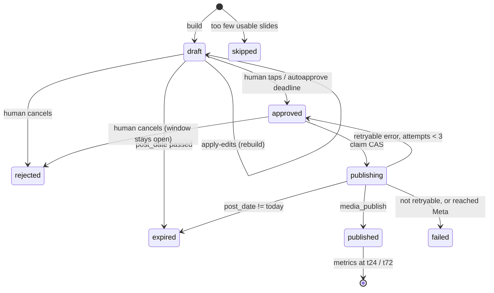

# Component: Social Publishing Pipeline

Turns events already in Supabase into an Instagram carousel, routes it past a human on Telegram, and
publishes it. Owns `src/scraper/social/`, plus the Telegram webhook and review page in the web app —
the approval loop spans both runtimes and is not describable without both.

---

## At a glance

| | |
|---|---|
| **Entry point** | `python -m scraper.social <subcommand>` |
| **Runs on** | GitHub Actions (`ig-daily`): build chained off the scrape; publish sweep every 30 min |
| **Writes** | `ig_posts`, `ig_post_edits`, `ig_post_metrics`, the `ig-slides` storage bucket, Instagram |
| **Requires** | Supabase + `IG_ACCESS_TOKEN` + `IG_BUSINESS_ACCOUNT_ID`; Pillow (`[social]` extra) |
| **Tests** | `tests/social/` — 331 tests, the best-covered part of the codebase |

**The defining property:** all third-party I/O happens at **build** time. By publish time every slide
is a JPEG we own, at the right dimensions, on infrastructure we control — so the publisher can only
fail Meta-side. Its corollary: **the caption and slides are frozen at build time.** The publisher must
never regenerate either, or the human would approve something different from what ships.

---

## Lifecycle of one post


```mermaid
stateDiagram-v2
    [*] --> draft: build
    [*] --> skipped: too few usable slides
    draft --> draft: apply-edits (rebuild)
    draft --> approved: human taps / autoapprove deadline
    draft --> rejected: human cancels
    draft --> expired: post_date passed
    approved --> rejected: human cancels (window stays open)
    approved --> publishing: claim CAS
    publishing --> published: media_publish
    publishing --> approved: retryable error, attempts < 3
    publishing --> failed: not retryable, or reached Meta
    publishing --> expired: post_date != today
    published --> [*]: metrics at t24 / t72
```

`build` in order (`social/__main__.py::_build_one`), now with the five council roles woven in at the
points where they can act on the data actually available to them (see
[Editorial council](#editorial-council-localnesspy-editorpy-clarifypy-criticpy) below):

1. Resolve the window for this `kind`, the score profile, and the period key.
2. Read approved events for the window — `storage.query_events_for_range(CITY, …)`.
3. Look up recently-posted slide keys for suppression, with a per-kind lookback.
4. **Localness auditor** runs first, before ranking — `chain_scope`/`is_local` must already be on the
   row for `selection.choose`'s `chain_venue_penalty` to have anything to read.
5. `selection.choose(...)` ranks everything; **the slide cap is applied later**, during the photo loop.
6. **Editor** reviews the ranked pool and returns bounded excludes/reorders/score nudges — still before
   the photo loop, so an excluded event never costs a download.
7. Fetch photos in rank order until `IG_MAX_SLIDES` is reached. A dead photo no longer drops the event
   — there is a text-only layout for exactly this case.
8. Below `IG_MIN_SLIDES` → write a `skipped` row and stop.
9. **Curator** assigns a content pillar to any surviving candidate the rule-based baseline left empty;
   **clarifier** generates a blurb for any title that fails the deterministic self-explanatory check.
   Both are cache-first — most builds call neither for a title/venue pair already judged once.
10. Re-sort **chronologically**, keeping each photo paired with its event.
11. Render cover + event slides (pillar chip, date footer, on-slide blurb); build the caption (blurb,
    multi-day/recurring framing).
12. **Critic** reviews the finished set + caption text and returns warn/block-severity notes. A block
    may carry a fix (`drop` / `clear_blurb`); those are applied, dropped slots are backfilled from the
    bench, the carousel is re-rendered and the critic runs once more, report-only. It never withholds
    the post.
13. `--dry-run` returns here; `--out` also writes JPEGs and `caption.txt` locally.
14. Insert the draft, with `council_verdicts` attached. A `None` return means the partial unique index
    rejected it because a live post already exists — a normal re-run outcome, not an error.
15. Upload slides, record their paths, notify Telegram (and email) — the notification appends a council
    block when any role produced output.
16. If `IG_AUTOPOST`: approve and publish immediately, in the same process.

---

## CLI reference

| Subcommand | Flags | What it does | When it runs |
|---|---|---|---|
| `build` | `--date`, `--dry-run`, `--out DIR`, `--kind` | Select, render, upload, draft, notify | Chained off `scheduled-scrape`; Thursdays for `weekend`; the 1st for `monthly` |
| `publish` | `--date`, `--dry-run` | Claims and ships every approved row whose `scheduled_for` has arrived | Every 30 min across El Paso daytime, and on demand |
| `apply-edits` | `--post-id`, `--dry-run` | Re-renders a draft to satisfy pending edit intents | Dispatched immediately by the webhook **and** unconditionally at the top of every sweep |
| `autoapprove` | `--date`, `--dry-run` | Flips untouched drafts past their deadline; expires stale ones | Step immediately before `publish` |
| `prune` | — | Deletes slide objects older than the retention window | Start of the build job |
| `metrics` | `--dry-run` | Snapshots t24/t72 performance; sends the "how yesterday did" digest | Last step of publish, non-fatal |
| `check-token` | `--min-days N` (14) | `/me` liveness, then expiry if introspectable. Exits 1 on trouble | `preflight`, and again in `build` (non-fatal) |
| `check-telegram` | — | Bot + webhook health. **Exits non-zero** and reports by email | `preflight` |
| `telegram-webhook` | `--set` | Inspect or register the webhook; refuses a redirecting URL | Once at setup, and after a domain change |
| `refresh-token` | — | Extends the long-lived token and **prints** it | Manual rotation inside the ~60-day window |

Three CLI quirks worth knowing:

- `--kind` offers `breaking`, but no cron fires it and the workflow does not list it. **Implemented,
  not scheduled.**
- `prune` is the fall-through default in `main()` rather than an explicit branch. Harmless today, but a
  future subcommand added without a dispatch branch would silently run `prune`.
- `telegram-webhook` returns 1 when problems exist, even without `--set`.

**The command you will use most:**

```bash
python -m scraper.social build --dry-run --out ./_preview
```

Renders everything locally, writes nothing anywhere. The fastest way to sanity-check any change to
selection, rendering or captions.

---

## Post kinds

| Kind | Window | Cover kicker | Count label | Suppression lookback |
|---|---|---|---|---|
| `digest` | one local day, **the day after `day`** | "TOMORROW IN / EL PASO" | "N things happening" | 14 d |
| `breaking` | one local day (`day` itself) | "JUST IN / EL PASO" | "N things happening" | 14 d |
| `weekend` | Fri 00:00 → Mon 00:00, on or after `day` | "THIS WEEKEND / IN EL PASO" | "N things to do" | 35 d |
| `monthly` | the calendar month | "THIS MONTH IN / EL PASO" | "N things to do" | 120 d |
| `horizon` | 60 days starting ~6 months out | "SAVE THE DATE / EL PASO" | "N on sale now" | 200 d |
| `weekly` | Mon 00:00 → the following Mon 00:00, on or after `day` — **six posts, one per content pillar** | "THIS WEEK IN / {PILLAR}" | "N things to do" | 35 d |
| `hype` | Not a window — the soonest not-yet-spotlighted event judged hype-worthy within 45 days | "DON'T MISS THIS / EL PASO" | "1 thing happening" | n/a — de-duped via `events.hype_posted_at`, not slide-key suppression |

One renderer serves all seven — see [ADR-0008](../architecture/adr/0008-one-parameterised-renderer.md).
Recurrence suppression is scoped **by kind**: a monthly roundup is supposed to repeat what the dailies
covered.

**`weekly` and `hype` are structurally different from the other five.** `weekly` reuses the exact same
multi-slot mechanism `IG_DIGEST_SLOTS` already gives the daily post (`_WEEKLY_PILLAR_SLOTS` in
`__main__.py`) — one Sunday build files six drafts, each staggered to its own posting hour via the
existing `scheduled_for`/publish-sweep machinery, no new publish cron needed. Each draft is a normal
roundup pre-filtered to rows whose `content_tags` contains that pillar, with `PROFILES["weekly"]`
neutralizing the category diversity cap (every row already shares the one pillar, so the ordinary cap
would otherwise throttle the post for no reason).

`hype` isn't a window/rank kind at all — no `ScoreProfile`, no `selection.choose()`. `_build_one`
branches early: `storage.query_hype_candidates()` picks the soonest approved event with
`is_hype = true` and `hype_posted_at is null`, wraps it as a single `Candidate` via the existing
`selection.candidates_from_rows()` rebuild helper, and reuses everything downstream (render, caption,
critic, insert) as if it were a 1-item carousel. `IG_MIN_SLIDES` doesn't apply to it — cover + one
event slide is the whole format by design. Candidates must start at least 24 hours out (the post goes
out later that day, so a nearer event could be announced after it is over). `hype_posted_at` is
written only after the draft and its slides exist, is checked, and is also stamped on other stored rows
that are the same real show (`hype.twin_ids`, the venue-name + stored-event match `selection.py`
uses), so a second source's copy is not spotlighted tomorrow; if the write fails twice the draft is
failed rather than risk a double post. A failed upload leaves the event free to retry; a draft a human
cancels keeps it spent. Weekly drafts auto-approve an hour before their own slot (not at the shared
17:00 deadline), so the six publish staggered. Whether an event even qualifies is judged by
`social/hype.py`, the same cache-once, model-judged, never-blocks shape `social/localness.py` already
established: a free deterministic pre-pass (no ticket link and not a major venue ⇒ definite no) gates
which events even reach one batched model call asking whether this is a headline touring artist, a
major convention, or a championship-level local game — most events, even ticketed ones, are expected to
get "no." Chained off the scrape (`workflow_run`, same trigger as the daily digest) as an extra step in
the same `build` job, not its own cron — most days it logs "nothing pending" and posts nothing.

**The digest ships a day ahead of the events it covers.** `build()` computes an `event_day = day + 1`
for `kind == "digest"` and threads it through `day_bounds`, `render_cover` and `build_caption`, while
`post_date`/`scheduled_for`/`auto_approve_at` stay pinned to `day` (the day the post actually ships).
This is deliberate: a 7am event is only useful to know about if the post goes out the evening before,
not that same afternoon. `breaking` deliberately keeps the old same-day window — advance notice
contradicts a "just announced" post.

---

## Selection (`selection.py`)

El Paso has far more qualifying events than the nine available slots, and *"the bulk of them are
routine library programming (storytimes, teen hangouts) that would make a dull post."* This module is
the editorial layer: hard filters, then a score, then diversity caps.

**Hard filters.** Non-empty title, title not a boilerplate listing header (`"event"`, `"calendar"`, …),
non-null `start_time`. Horizon additionally requires ticket links. Repeats within the window collapse
to their first occurrence. The photo gate is deliberately *not* here, since it costs a download.

**Score.**

```
score = 3.0 * category_weight
      + ticket_bonus        if ticket_links
      + evening_bonus       if 17 <= local hour <= 23
      + 0.8                 if len(description) >= 120
      + 0.6                 if venue_id resolved
      - recurrence_penalty * min(1.0, recurrence_count / 10)
      - recently_posted_penalty  if the slide key was posted recently
```

Category weights: Music and Festivals 1.0, Food & Drink 0.9, Arts & Theatre 0.85, Sports 0.7, Tech 0.6,
Family 0.5, Community 0.25, Libraries 0.15, anything unmapped 0.5. A row takes the **max** across its
categories, so one strong category lifts the event. Two subtleties: an unmapped string gets the
default *"so a new source never silently scores zero"*, and `"Community"` is also the fallback
category, so weighting it 0.25 deliberately down-weights **unclassified** events too.

`_categories()` prefers `events.content_tags` (the six Instagram-only pillars — see
[Content pillars](#content-pillars-corecontent_tagspy)) over `categories`, falling back
to `categories` for any row a pillar hasn't reached yet, so behaviour for un-pillared rows is unchanged.
The venue/category diversity caps run against pillars once present, since six clean buckets are a far
better diversity axis than the ~95 free-text `categories` values.

`ScoreProfile` also carries `chain_venue_penalty` (default `0.0`, so every profile is a behavioural
no-op until deliberately raised). `score_event` applies it only when `venues.chain_scope == "national"`
**and** the pillar is Food & Drink or Fitness & Activities — narrow on purpose, since an unqualified
localness filter would also dock a Ticketmaster arena show, which is exactly the kind of thing worth
posting regardless of who owns the building.

There is an image-quality term in the formula, but `_build_one` never passes `image_sizes`, so **it
contributes nothing in production**. Photo quality affects a slide's *availability*, not its rank.

**Caps** (from the profile; see the [ADR-0008 matrix](../architecture/adr/0008-one-parameterised-renderer.md#consequences)):

- The venue cap **exempts** candidates with no resolvable venue.
- The category cap skips a candidate only when **all** of its categories are at the cap, so a
  multi-category event slips through while any one has room.
- Output is re-sorted **chronologically**: *"a carousel that reads 9am → 10pm is a schedule someone can
  act on, whereas score order is a ranked list nobody asked for."*

**Identity keys.** `venue_key` deliberately keys on the venue **name**, not `venue_id`, with a war
story attached: the Abraham Chavez Theatre holds three ids because sources punctuate its address
differently, *"so keying on the id put the same concert on the carousel three times and defeated the
per-venue diversity cap at the same time."* The address normaliser the old comment deferred now
exists — `core/address.py::venue_identity` — and `storage._address_hash` delegates to it on the write
side, so new venue rows converge on one id instead of drifting. `venue_key` here keeps its
name-first read-side behaviour regardless, because a promoter brand like "El Paso Live" legitimately
covers more than one building and name-keying is the only thing that catches that case. See
[scraper-engine.md](scraper-engine.md#venue-identity-coreaddresspy) for the normaliser itself.

`dedupe_key` strips date and occurrence tails from the title before hashing, because recurring events
are stored as **one row per date with a fresh uuid**, so event ids cannot answer "did we post this last
week?".

**`candidates_from_rows`** is the no-rank path used by rebuilds: *"`choose` ranks and filters; a
rebuild must do neither. The post's slide order was settled when it was first built and a human has
since reviewed it."*

---

## Rendering (`render.py`, `imaging.py`)

Canvas is 1080×1350 (4:5) — the tallest portrait Instagram allows. JPEG only; see
[ADR-0012](../architecture/adr/0012-python-rendering-not-satori.md).

**Three event-slide layouts**, cycled deterministically:

| # | Builder | Composition |
|---|---|---|
| 0 | `_slide_bold_block` | Photo top, paper panel bottom, torn seam, taped corner |
| 1 | `_slide_full_bleed` | Photo fills the canvas; a torn accent-coloured card overlaps the lower third |
| 2 | `_slide_split_panel` | Photo on the top ~65%; bottom panel a solid accent — a colour-inversion beat |

Layout cycles with period 3 and accent with period 2, **so the (layout, accent) pair only repeats every
six slides**. Both are seeded from the event id via SHA-1 rather than `hash()`, *"which is randomized
per-process and would make the same event tear differently every run."*

**"Nothing cropped, nothing blurred, nothing ellipsised"** is enforced by four cooperating mechanisms —
an elastic photo band sized to the source's own aspect, a 12% crop ceiling above which the whole image
is mounted on a paper board, a paper mount instead of a blurred backdrop, and height-budget text
fitting instead of line capping. Each has a live-slide failure behind it; see
[invariants §5](../architecture/invariants.md#5-rendering).

**Photo quality gate** (`imaging.fetch_photo`) — never raises, returns `None` for anything unusable:

| Gate | Value |
|---|---|
| Download cap | 25 MiB (decompression bombs, print-res TIFFs) |
| Absolute floor | 320 px on either axis |
| Upscale ceiling | 1.75× against a 1080×860 reference |

The gate is expressed as **required upscale, not raw pixels**, because *"a flat short-side threshold
gets this wrong in both directions: it rejects Visit El Paso's 930×560 derivatives (which only need
1.5× and look fine) while passing a 2000×300 banner whose height would need 2.9×."*

**Fonts.** Four static TTFs in `assets/fonts/`. A missing file does **not** raise — it warns once per
role and falls back to Pillow's bitmap font, so slides publish off-brand. A **variable** font is worse:
it silently renders Regular with no error at all.

**Date footer.** All three builders draw a small, quiet date line at the **bottom** of the slide, below
the content block (`_date_footer_text` / `_draw_date_footer`), never beside the time. The cover already
establishes the day for a `weekend`/`monthly` post, so the date here is a confirmation, not a headline —
the clock time stays the prominent temporal fact. It also makes a run of same-titled recurring slides
(24 "El Paso Rhinos" home games, say) visibly distinct from one another. Deliberately plain text: no perforated edge, ticket stub, or other physical affordance a static JPEG
can't back up — same standing rule that keeps the torn-paper/tape idiom nearby purely decorative. See
[invariants §5](../architecture/invariants.md#5-rendering).

**On-slide blurb.** When `events.blurb` is set, `_blurb_text` / `_draw_blurb` render it as a standfirst
line under the title, on the flyer itself — not just in the caption. Height-budgeted the same way the
title is, so a long blurb degrades gracefully rather than overflowing. See
[Editorial council](#editorial-council-localnesspy-editorpy-clarifypy-criticpy) for how a blurb gets
written in the first place.

---

## Content pillars (`core/content_tags.py`)

Six Instagram-only editorial labels — **Arts & Culture, Live Music, Sports, Fitness & Activities,
Family, Food & Drink** — used for slide chips, hashtags/emoji, score weighting and the per-post
diversity cap. `content_tags` is **not** a replacement for the website's `categories` taxonomy: the
filter rail, the event-card, the submission form, and the knowledge-base export all keep reading
`categories` exactly as before. `content_tags`/`content_tags_source` (`rule`/`council`/`manual`) are
additive columns on `events` (migration `0012_editorial`, see
[migrations.md](../data/migrations.md)) that sit alongside it.

Why a separate column rather than cleaning `categories` in place: `categories` is union-only on
write — it can only grow, never shrink, so a bad tag from a scrape artifact never self-heals. Pillars
are written fresh and can be corrected.

`pillars_for(title, categories, venue)` is a cheap, deterministic **baseline**, run in the orchestrator
alongside `_localize_times` so every row gets a first pass with no model call. It returns `[]` — no
catch-all bucket — for anything genuinely ambiguous, rather than guessing. Two cases worth knowing
because they were wrong once in production and are now regression-tested
(`tests/core/test_content_tags.py`):

- **Sports is spectator-only.** A bare team name like `"utep"` is not enough — "Voice Area Alumni
  Ensemble" mentioning UTEP is not a sports event. The `_SPECTATOR` regex requires a versus-marker
  (`vs`/`v.` followed by more text) or a named spectator activity (`lucha libre`, `boxeo`, `rodeo`, …).
  A Roman-numeral title like "Devious Maids Season V" does not match, since nothing follows the `v`.
- **Fitness requires a qualified phrase.** Bare `"barre"` tagged a UTEP dance production (a
  ballet-barre pun) as Fitness; it now needs `"barre class"`, `"pure barre"`, `"barre fitness"` or
  `"barre workout"`.

Anything the rule stage leaves at `[]` — "Baby Yoga and Sound Bath" at a children's museum, say, which
is Family, not Fitness, and no keyword table can tell the difference — is exactly what the **curator**
role (below) exists to judge. `backfill_content_tags.py` runs the baseline over existing rows;
`_merge_into`/`_apply_merge` **replace** `content_tags` on write (the opposite of `categories`'
union-only rule) but never overwrite a `council`/`manual` value with a `rule` one.

---

## Editorial council (`localness.py`, `editor.py`, `clarify.py`, `critic.py`)

Five model-backed roles that add judgment the deterministic scoring in `selection.py` can't — "decide
better what goes where" was the explicit ask. All five share one contract, enforced by
`core/llm.py::complete_json` and a bounded Python referee around each role: **never block a post.**
Any failure — model down, malformed JSON, missing key, budget exhausted — leaves the pipeline's
behaviour identical to `COUNCIL_ENABLED=false`. This is pinned by tests, not just documented.

| Role | Module | When it runs | Judges | Cache |
|---|---|---|---|---|
| Localness auditor | `localness.py` | Before `selection.choose` | Is this venue local, regional, or a national chain? | `venues.chain_scope`/`is_local`, forever |
| Curator | `clarify.py::assign_pillars` | After the photo loop, per surviving candidate | Which content pillar, when the rule baseline returned `[]` | `events.content_tags` |
| Clarifier | `clarify.py::generate_blurb` | After the photo loop, per surviving candidate | Does the title need a plain-language line, and if so what | `events.blurb` |
| Editor | `editor.py` | After `selection.choose`, before the photo loop | Reorder/exclude/nudge the ranked pool | None — per-build |
| Critic | `critic.py` | After the caption is built | Anything off about the final set + caption text | None — per-build |

**Localness auditor.** A deterministic `_KNOWN_CHAINS` pre-pass (Flix Brewhouse, Topgolf, Dave &
Buster's, Cinemark, …) resolves the obvious chains with **zero API calls**; the folded-name match
(`_smash`) strips whitespace after folding because `fold()` turns an apostrophe into a space, not
nothing — `"Lowe's"` → `"lowe s"` — and a naive compare would miss it. Anything left goes to the model
in a batch, cached on the venue row forever, so cost does not scale with rebuilds.

**Curator / clarifier.** Both cache-first, both idempotent, both **skip a real deterministic gate**
before ever calling a model: the clarifier only runs for a title that fails
`clarify.needs_clarifier()` (already matches a versus-marker, a known team, `"(Touring)"`, or reads as
plain-language on its own). The prompt asks *what the description adds beyond the title*, not *whether
the title is clear* — the original self-explanatory framing caused real under-writing (it skipped a
useful blurb for the El Paso Margarita Festival, whose description names a tasting contest, a DJ and a
beer garden, because "you can guess it's about margaritas"). Reframing doubled useful-blurb yield in
direct measurement against the same events (0/3 → 4/4). Blurbs are truncated at a clause boundary
(comma/semicolon), not mid-word, and never invented from an empty `description` — the anti-invention
guard skips the call entirely rather than let the model fill a gap with a guess.

**Editor and critic — the referee's bounds** (pure Python, no network, applied after every call):

1. Excludes capped at `max(2, len(ranked) // 4)`, applied in rank order.
2. Never reduce the pool below `IG_MAX_SLIDES + 2`.
3. **More than half excluded → the entire response is discarded**, logged as an error.
4. `score_delta` clamped to ±2.0 — enough to reshuffle neighbours, not enough to invert the ranking.
5. A pillar outside the six, or a blurb over its character cap, is rejected rather than stored.
6. A verdict for an id not in the current pool is dropped silently.
7. A hard per-build call budget, `COUNCIL_MAX_CALLS`.

The critic's `"block"`-severity notes never hold the post and get no button of their own (ADR-0003),
but the critic *does* repair what it can before the human sees the carousel. A block tied to one
event may carry `fix: "drop"` (with `duplicate_of` for a same-happening pair) or `fix: "clear_blurb"`.
`critic.plan_fixes()` enforces the bounds in Python: only blocks on a specific slide are acted on; a
duplicate pair drops the **lower-scored** listing whichever slide the model named, and only once even
when reported on both slides; at most `_MAX_DROPS` (2) events per build. `_apply_critic_fixes` in
`__main__.py` backfills each dropped slot from the editor's pool by score, re-renders, and runs the
critic a second time, report-only — fixes are never chained. Telegram shows what was repaired as
`🛠 Fixed:` lines, and only the second pass's issues as ⛔/⚠️. A cleared blurb is cleared on that
build's copy of the row only.

The diversity caps (`max_per_venue`, `max_per_category`) are a preference, not a reason to ship a
short post: `choose(fill_to=IG_MAX_SLIDES + 2)` adds cap-skipped events back, in score order, until
the pool can fill a full post plus the editor's two-deep bench (duplicates still refused). Without it,
2026-09-23 had ten distinct events and posted seven — three museum exhibitions tripped the
Arts & Culture cap.

Same-venue duplicates under different titles are also collapsed deterministically in
`selection.choose` (`_duplicates_a_pick`): venue matched by **name**, then storage's
venue-confirmed `is_same_stored_event` test. This catches the pair storage's venue_id-keyed merge
misses when two sources' addresses fork two venue rows (2026-09-23: Disney On Ice at the Coliseum,
"4100 East Paisano Street" vs "4100 E Paisano Dr").

**Config** (`core/config.py`; full reference in
[configuration.md](../operations/configuration.md#editorial-council)): `OPENROUTER_API_KEY`,
`COUNCIL_ENABLED` (default off), `COUNCIL_MODEL` (default `anthropic/claude-haiku-4.5`, chosen after an
empirical bake-off against pricier models), `COUNCIL_MAX_CALLS`, `COUNCIL_TIMEOUT_SECONDS`. Calls go
through OpenRouter rather than a vendor SDK directly, via `core/llm.py::complete_json`.

**Cost**, measured empirically from live `usage` fields on real production events (not estimated) —
well under $0.01 per post and well under $0.35/month at current volume on `claude-haiku-4.5`. Cache-first
roles (localness, curator, clarifier) are one-time-ish per venue/event; only editor and critic run on
every single build.

**Surfacing.** `ig_posts.council_verdicts` (jsonb) is written once by the build process, so the
lost-update problem [ADR-0009](../architecture/adr/0009-edit-intents-as-rows.md) exists for doesn't
apply here. `notify.py` appends a short council block to the Telegram message when any role produced
output — no new buttons, since the existing drop/caption/swap actions already cover what a human can do
about it.

---

## Human-in-the-loop approval

### Auth model

Three independent boundaries:

| Path | Boundary |
|---|---|
| Telegram buttons | The chat itself. Webhook checks the `X-Telegram-Bot-Api-Secret-Token` header **and** the chat-id allowlist |
| Email / review link | HMAC-signed, expiring token verified in TypeScript |
| `/admin/ig` | Supabase session + `ADMIN_EMAILS` allowlist |

`TELEGRAM_CHAT_ID` is comma-separated with **asymmetric semantics**: Python sends notifications only to
the first entry, while the webhook treats every entry as permitted to act — *"after moving
notifications to a group, the button-bearing messages already sitting in an admin's DM don't silently
stop working when tapped."*

An unauthorized *text* message is silently ignored rather than answered, because replying would confirm
to a stranger that the bot exists and responds.

### The notification

**Two independent messages, buttons first.** They used to share one `try` block, which meant a single
unreachable image URL swallowed the buttons too — *"and the failure looked identical to 'the bot went
quiet'."*

| Button | Effect |
|---|---|
| Post now | Approve **and** pull `scheduled_for` to now, then dispatch immediately |
| Tomorrow | Postpone — **moves both** `scheduled_for` and `auto_approve_at` |
| Caption | `force_reply` prompt; a plain UPDATE, no re-render |
| Drop event | Event picker → records a `drop_event` intent |
| Swap photo | Event picker → photo prompt → records a `swap_photo` intent |
| Cancel | Reject; accepted while `draft` **or** `approved` |
| Full preview | The HMAC review page, when a token was minted |

When `council_verdicts` is non-empty, a short addendum block (`_council_block`) is appended after the
buttons — editor/critic notes, in plain language, with no button of its own.

`parse_mode` is deliberately omitted — event titles routinely contain `_ * [ ]`, any of which breaks
Telegram's Markdown parser and drops the message entirely.

Under opt-out the lead line reads *"Goes out automatically at {when} unless you cancel"*, because a
post that ships unless you stop it, announced by a button saying "Approve", trains the wrong habit.

### Edits

Recorded as intents in `ig_post_edits` and applied by `apply-edits` —
[ADR-0009](../architecture/adr/0009-edit-intents-as-rows.md) covers the reasoning and the full list of
rebuild rules.

**A `drop_event` backfills the slot it opened**, the same way the critic's own drops do at build time
(`_backfill_for_edit`, the edit-time counterpart to `_apply_critic_fixes`). Since an edit runs long
after the original build, there is no `ranked` pool sitting in memory to draw on — it re-derives an
equivalent one from the post's own stored `window_start`/`window_end`/`kind`, scores it exactly as a
fresh build would, and relaxes the diversity caps entirely (`fill_to=len(rows)`, since they already did
their job in the original build) so it can pull in anything the day supports, not just enough to clear
`IG_MIN_SLIDES`. Two things it will never do:

- **Hand the human their own drop back.** The dropped id is still a real, approved event sitting in
  that same window query, so it is excluded by id explicitly — without that, a bench with nothing
  better available would just re-add it.
- **Re-admit a duplicate of something still on the post**, via the same `selection._duplicates_a_pick`
  check `choose()` itself uses — a guard against an older draft (built before that dedup existed)
  already carrying a stale duplicate.

Best-effort only: an older post's row (or a caller) missing `window_start`/`window_end` gets no
backfill rather than an error — a shorter post, not a crash. `swap_photo` alone never triggers this
(it doesn't change the slide count), and it activates only when a drop actually removed an id.

### The auto-approve sweep

*"The morning build files a draft and pings Telegram; the human has all day to cancel, postpone or
edit it; and if the deadline arrives with the row still sitting in 'draft', silence is read as
consent."*

| Condition | Behaviour |
|---|---|
| `IG_AUTO_APPROVE` off | Total no-op, logged |
| `IG_AUTOPOST` on | Warns it is **inert** rather than looking like a silent no-op |
| `post_date < today` | `expired`, never resurrected |
| Unapplied edits exist | **Fails closed** — holds the post, alerts once |
| CAS lost | Logged as not-an-error: a human got there first, and they win |

---

## Publishing (`publish.py`)

Three Graph calls against `https://graph.instagram.com/v21.0`: create a child container per slide,
create the carousel container, publish it.

- Max 10 carousel items, enforced before any network call. `IG_MAX_SLIDES` defaults to 9 — plus the
  cover, that is exactly 10.
- **Children are created sequentially, never with `gather()`** — Graph rate-limits bursts.
- Each child is polled to `FINISHED` with exponential backoff (90s budget), because publishing a
  container that is still `IN_PROGRESS` fails and Meta's image fetch is not instant.
- A child that fails is **skipped, not fatal**; the post fails only if survivors fall below the minimum.
- Meta fetches `image_url` **server-side**, so the signed URLs must be publicly reachable.

Crash safety, retry rules and the container-id ordering: [ADR-0004](../architecture/adr/0004-crash-safety-over-retry.md).

### Token checks — read this before trusting any of them

`TOKEN_INTROSPECTION_SUPPORTED` is **False for this account.** `/debug_token` is a Facebook-Login-flow
endpoint; this app went through *"Instagram API with Instagram Login"*, whose host is
`graph.instagram.com` — and that host answers every `/debug_token` call with a 500 regardless of token
health. Confirmed live: the very token it was 500ing on returned 200 for `/me`.

So the live check is `token_identity()`, a `/me` liveness probe that deliberately lets its exception
propagate — *"failing this call IS the finding."* When introspection is unavailable, `check-token` says
so explicitly *"so nobody reads a green check as 'expiry verified'."*

**Rotation** is `refresh-token`, which extends the ~60-day window and **prints** the new token —
nothing in CI can rotate a repo secret on its own. The token must be ≥24h old and still valid:
*"a refresh is not a resurrection."* Run it well inside the window, e.g. every 45 days.

The long-lived **exchange** (`ig_exchange_token`) remains unsolved — "Session key invalid" on
console-issued tokens, with wrong-secret, invalid-token and unaccepted-invite all ruled out. The
documented instruction is **do not re-derive this**; start from `docs/meta-instagram-onboarding.md:290-312`.

---

## Metrics (`metrics.py`)

Collected at t24 and t72: reach, saved, shares, views, total interactions, likes, comments, profile
visits, follows — plus media-node fields, which win on conflict because *"the node fields are the ones
Instagram itself shows on the post, so a discrepancy should resolve to what a human would see."*

Two framing points from the module docstring:

- **There is no per-slide attribution.** A carousel is one media object; a number describes a *post*,
  never an event or a category.
- **The supported metric set is a moving target.** `impressions` was retired for `views`; `navigation`
  is not offered. So `fetch_insights` drops whatever metric a 400 names and retries — terminating
  because each pass drops at most one name and any other error raises.

Both columns **and** `raw` are stored, so the next metric rename costs a column of NULLs rather than
the data.

The digest fires only on a **fresh t24 write with no error** — one message the morning after a post,
not a repeat every half hour for three days. It appends a percentage delta against a 7-snapshot
baseline, because *"a bare '412 reach' means nothing to a reader who does not already know what normal
looks like."*

Collection is scheduled by "published long enough ago **and** missing this window", which makes it
idempotent and self-healing.

---

## Slide storage (`slides_store.py`)

| | |
|---|---|
| Bucket | `ig-slides`, **private** |
| Path | `{post_date}/{post_id}/{NN}.jpg` — date-first so pruning is a cheap prefix sweep |
| Signed URL TTL | 7 days |
| Retention | `IG_SLIDE_RETENTION_DAYS`, default 7; swept at the start of each build |

Private because *"signed URLs are still plain unauthenticated HTTPS GETs, so Meta's server-side cURL
fetches them fine — a public bucket would buy nothing and leave a permanently enumerable hotlink
surface over other people's event photos."*

`signed_urls` **raises** if any path cannot be signed: *"a carousel missing a slide is not something to
paper over."*

Pruning lags rather than deleting at publish time, so one sweep cleans up published, rejected, expired
**and** orphaned uploads with no per-status bookkeeping — and leaves a half-failed publish something to
retry against.

> The bucket exists only because someone called `create_bucket()` once. **No migration creates it** —
> a fresh environment needs it provisioned by hand.

---

## Gotchas

1. **`CITY = "El Paso"` is hardcoded** (`social/__main__.py:37`), so a Juárez event whose `location`
   lacks "El Paso" can never reach a carousel. See [known-gaps](../known-gaps.md).
2. **A stale docstring:** `fetch_photo` says an unusable photo means the event loses its slot. It no
   longer does — there is a text-only layout. `__main__.py:147-151` is the current behaviour.
3. **Two redaction implementations exist** — `metrics._redact` and `http.redact_secrets`. Not a bug,
   but know which one a given module uses.
4. **`slides_store.py` has no test file.** `object_path`, the signed-URL key-spelling tolerance, and
   `prune_before`'s folder walk are all untested.
5. **`THREADS_ACCESS_TOKEN` / `THREADS_USER_ID` are read but never used** by anything in this pipeline
   — scaffolding for a surface that does not exist.
6. **`IG_AUTOPOST` and `IG_AUTO_APPROVE` are not the same switch.** See the
   [glossary](../glossary.md#ig_autopost-vs-ig_auto_approve).
7. **Postponing must move both timestamps** — the sharpest edge in the opt-out design.
8. **Never regenerate the caption or slides at publish time.**
9. **The council never blocks.** If a build looks stuck or a post looks off, the cause is somewhere
   else — check `COUNCIL_ENABLED`/`OPENROUTER_API_KEY` and the referee bounds in
   [Editorial council](#editorial-council-localnesspy-editorpy-clarifypy-criticpy) before suspecting it.
10. **Editor/critic verdicts are not reproducible build-to-build.** They're model judgment, not a pure
    function of the input — determinism is enforced only at the referee's bounds, not the content. Two
    builds of the same pool can legitimately disagree on which events the editor excludes.

---

*Verified against commit `7629204` (2026-09-20). Last updated 2026-09-22.*
