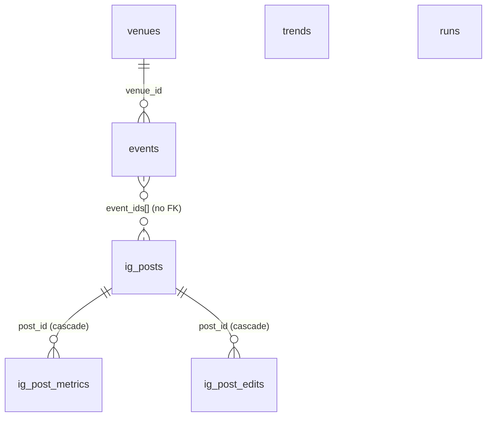

# Database Schema

Authoritative source: `supabase/migrations/*.sql`. Seven tables in `public`, one storage bucket.

The database is the integration point between every component, so this is the most widely-depended-on
contract in the system. Read [migrations.md](migrations.md) before changing any of it.



Note `ig_posts.event_ids` is a `uuid[]` with **no foreign key** — the array is positional and matches
slide order.

---

## `events`

The central table. Scraped rows land `approved`; user submissions land `pending`.

| Column | Type | Null | Default | Meaning |
|---|---|---|---|---|
| `id` | uuid PK | no | `gen_random_uuid()` | The id the public site routes on |
| `source` | text | no | — | Connector that produced the row |
| `source_id` | text | yes | — | The provider's own id, when it has one |
| `title` | text | no | — | Event name as published |
| `description` | text | yes | — | Source blurb; truncated to 400 chars in the KB export |
| `start_time` | timestamptz | yes | — | **Aware and event-local** — see [ADR-0002](../architecture/adr/0002-local-timestamp-invariant.md) |
| `end_time` | timestamptz | yes | — | Rarely populated |
| `venue` | text | yes | — | Raw venue name; part of the venue natural key |
| `location` | text | yes | — | Raw full address; part of the venue natural key, and what the region filters match on |
| `url` | text | yes | — | Canonical source URL; **also the primary dedupe key** |
| `image_url` | text | yes | — | Source photo, sanitised by `media.clean_image_url` |
| `categories` | text[] | yes | `'{}'` | Multi-label, not one |
| `raw` | jsonb | yes | `'{}'` | **Load-bearing** — every backfill re-derives from it |
| `content_hash` | text | no **UNIQUE** | — | The upsert key |
| `first_seen` | timestamptz | no | `now()` | Protected by trigger; an upsert can never clobber it |
| `last_seen` | timestamptz | no | `now()` | Refreshed by trigger on every write |
| `venue_id` | uuid FK → `venues(id)` | yes | — | NULL for virtual or venue-less events |
| `status` | text | no | `'approved'` | `approved` / `pending` / `rejected`. **No CHECK constraint** |
| `submitted_by` | uuid | yes | — | An `auth.users` id. **No FK declared** |
| `ticket_links` | jsonb | no | `'[]'` | `[{source, label, url}]` — one merged event, many purchase links |

**Indexes:** GIN full-text on `location`; btree on `start_time`, `last_seen`, `status`, `venue_id`.

**Trigger `events_touch_last_seen`** (BEFORE INSERT OR UPDATE):

```sql
new.last_seen := now();
if tg_op = 'UPDATE' then new.first_seen := old.first_seen; end if;
```

So an application-supplied `last_seen` is always overwritten, and `first_seen` can never be edited
through an UPDATE. `_event_row()` omits both columns and lets the database own them. Because an upsert
of an unchanged event still performs an UPDATE, **`last_seen` is a reliable liveness signal** — "this
event was still listed at the source as of T" — which is exactly what the freshness cache reads.

---

## `venues`

| Column | Type | Null | Default | Meaning |
|---|---|---|---|---|
| `id` | uuid PK | no | `gen_random_uuid()` | Referenced by `events.venue_id` |
| `name` | text | yes | — | Cleaned display name |
| `address` | text | yes | — | Cleaned / geocoded full address |
| `city`, `region`, `postal`, `country` | text | yes | — | Enriched from `events.raw` |
| `lat`, `lng` | double precision | yes | — | Map pins and region gating |
| `address_hash` | text | no **UNIQUE** | — | The natural key — see below |
| `created_at` | timestamptz | yes | `now()` | |

**Indexes:** `city`, and a composite on `(lat, lng)`. Requires the `pgcrypto` extension for `digest()`.

---

## `trends`

`id`, `source`, `platform`, `topic`, `title`, `summary`, `url`, `score`, `engagement` (jsonb),
`captured_for`, `raw`, `content_hash` (UNIQUE), `captured_at`.

`captured_for` is the original request topic and is what the freshness cache and `query_stored` match
against. There is **no trigger** here — `captured_at` is static. Indexed on `platform`,
`captured_for`, `captured_at`, and `score desc`.

---

## `runs`

The observability log: `id`, `tool`, `params` (jsonb), `source_counts` (jsonb), `status`, `error`,
`started_at`. Written by `orchestrator.log_run` after every run.

The **per-source counts are the only way to distinguish "a source found nothing" from "a source is
silently broken"**, so this table is the first place to look when coverage drops.

> **RLS was not enabled on this table until 0011.** See [Row-level security](#row-level-security).

---

## `ig_posts`

One row per rendered carousel.

| Column | Type | Null | Default | Meaning |
|---|---|---|---|---|
| `id` | uuid PK | no | `gen_random_uuid()` | |
| `post_date` | date | no | — | The day this **posts** — not the event window |
| `status` | text | no | `'draft'` | CHECK: `draft`, `approved`, `publishing`, `published`, `failed`, `rejected`, `skipped`, `expired` |
| `slide_paths` | text[] | no | `'{}'` | Storage paths; `[0]` is the cover. **Positional** |
| `event_ids` | uuid[] | no | `'{}'` | Events in slide order |
| `slide_keys` | text[] | no | `'{}'` | Content-derived keys, stable across recurrences — the only thing that makes recurrence suppression possible |
| `caption` | text | no | `''` | Frozen at build time |
| `ig_creation_id` | text | yes | — | Written **before** `media_publish`. Its presence means "reached Meta — do not retry" |
| `ig_media_id` | text | yes | — | Published media id |
| `attempts` | int | no | `0` | Stops a deterministically-failing row burning the 100/day container limit |
| `claimed_at` | timestamptz | yes | — | Lease timestamp for the CAS claim, so a crashed runner's row can be reclaimed |
| `error` | text | yes | — | Last error, **secret-redacted before write** |
| `created_at` / `published_at` | timestamptz | | | |
| `scheduled_for` | timestamptz | yes | — | Best-effort publish time. NULL = no restriction |
| `kind` | text | no | `'digest'` | CHECK: `digest`, `breaking`, `weekend`, `monthly`, `horizon` |
| `slot` | text | yes | — | Which digest, when several run per day. NULL = the single unnamed one |
| `auto_approve_at` | timestamptz | yes | — | When an untouched draft approves itself. **NULL = never** |
| `approved_by` | text | yes | — | CHECK: `human` / `auto` — editorial intent vs opt-out shipping |
| `window_start` / `window_end` | timestamptz | yes | — | The event window this was built from; cannot be re-derived from `post_date` for weekend or monthly |
| `photo_overrides` | jsonb | no | `'{}'` | Accepted photo swaps, keyed by **event uuid, not slide index** |
| `caption_is_custom` | boolean | no | `false` | Stops a rebuild overwriting a human's caption |
| `period_key` | text | yes | — | `YYYY-Www` / `YYYY-MM` bucket for non-daily posts |

### The partial unique indexes — the load-bearing constraints

| Index | Definition | Purpose |
|---|---|---|
| `ig_posts_live_digest_slot_idx` | `(post_date, coalesce(slot,''))` where status is live **and** `kind='digest'` | At most one live daily digest per date and slot |
| `ig_posts_live_period_idx` | `(kind, period_key)` where status is live, `kind <> 'digest'`, `period_key` not null | One live post per kind and period |
| `ig_posts_auto_approve_idx` | `(auto_approve_at)` where `status='draft'` | Keeps the 30-minute sweep off a sequential scan |
| `ig_posts_status_idx` | `(status, post_date)` | General queue reads |

"Live" means `('draft','approved','publishing','published')`. **Terminal-but-discarded states are
excluded on purpose**, so a rejected, skipped or expired row never blocks rebuilding that date.
`create_ig_draft` returning `None` means one of these indexes rejected the insert because a live post
already exists — a normal re-run outcome, not an error.

`period_key` is a stored column rather than a derived expression because `date_trunc(text,
timestamptz)` is `STABLE`, not `IMMUTABLE`, and cannot appear in an index predicate.

---

## `ig_post_metrics`

`id`, `post_id` (FK → `ig_posts` ON DELETE CASCADE), `window_label` (CHECK `t24` / `t72`),
`fetched_at`, then `likes`, `comments`, `saves`, `reach`, `shares`, `views`, `total_interactions`,
`profile_visits`, `follows`, `raw` (jsonb, not null), `error`.

**`(post_id, window_label)` is UNIQUE**, which makes a re-run an upsert — and that matters because
collection is driven by *"published long enough ago and missing this window"* rather than by a cron
firing at an exact minute.

`views` replaces Meta's retired `impressions`. `raw` holds the full payload so the next metric rename
costs a column of NULLs rather than the data.

---

## `ig_post_edits`

`id`, `post_id` (FK → `ig_posts` ON DELETE CASCADE), `op` (CHECK `drop_event` / `swap_photo`),
`payload` (jsonb), `requested_at`, `applied_at` (NULL = pending), `error`.

Indexed on `(post_id) WHERE applied_at IS NULL`. `requested_at` is also the natural replay order.

Why a table rather than a jsonb column on `ig_posts`:
[ADR-0009](../architecture/adr/0009-edit-intents-as-rows.md).

> **RLS was not enabled on this table until 0011.** See below.

---

## Identity keys

### `events.content_hash`

Computed in Python, never in SQL (`core/dedupe.py:55-75`):

```
_event_key(e) = norm(e.url)  if e.url
              = f"{norm(title)}|{YYYY-MM-DD}|{norm(venue or location)}"  otherwise
content_hash  = sha1(_event_key)
```

**A URL is the identity when present.** Two genuinely different events sharing one listing URL collapse
into one row; a source that changes its URL scheme re-inserts its whole catalogue as new rows.

### `venues.address_hash`

```
sha1( lower(trim(coalesce(address,''))) || '|' || lower(trim(coalesce(venue_name,''))) )
```

where "address" is `events.location` and "venue_name" is `events.venue`. **Implemented three times** —
Python, SQL, TypeScript — and all three must stay byte-identical. There is **no test pinning their
equivalence**; that is a known gap.

### The two-stage merge

1. **In-batch** (`dedupe.dedupe_events`) — the same concert from Ticketmaster and Eventbrite in one
   scrape.
2. **Cross-run** (`Storage._merge_with_existing`) — the same event appearing on a *new* ticketing site
   next week. Without it, every new site a venue's event lands on would create a second card instead of
   adding a ticket link.

---

## Row-level security

| Table | RLS | Policies |
|---|---|---|
| `events` | on | 3 |
| `venues` | on | 2 |
| `trends` | on | 1 |
| `ig_posts` | on | **none** — deny-all for anon |
| `ig_post_metrics` | on | **none** — deny-all for anon |
| `ig_post_edits` | on (0011) | **none** — deny-all for anon |
| `runs` | on (0011) | **none** — deny-all for anon |

| Policy | Table | Cmd | Roles | Predicate |
|---|---|---|---|---|
| `events_select_approved` | events | SELECT | anon, authenticated | `status = 'approved'` |
| `events_select_own` | events | SELECT | authenticated | `submitted_by = auth.uid()` |
| `events_insert_pending` | events | INSERT | authenticated | `status = 'pending' AND submitted_by = auth.uid()` |
| `venues_select_all` | venues | SELECT | anon, authenticated | `true` |
| `venues_insert_authenticated` | venues | INSERT | authenticated | `true` |
| `trends_select_all` | trends | SELECT | anon, authenticated | `true` |

**There is no UPDATE or DELETE policy on any table for any role.** Moderation happens through the
service-role key by design — not even a submitter can edit their own pending row.

`events_insert_pending` is what makes the browser-writes-directly-to-Postgres submission flow safe: a
user cannot self-approve or attribute a submission to someone else.

### The service-role warning

The scraper, the carousel pipeline, the KB export and every admin server action use the **service-role
key, which bypasses RLS entirely.** RLS will not protect a public surface built on a service-role read.
See [invariants §3](../architecture/invariants.md#a-public-facing-read-must-filter-status-itself).

### Two tables that shipped without RLS

`runs` and `ig_post_edits` had no `enable row level security` statement in any migration through 0010,
which left both reachable through PostgREST by the published anon key.
`0011_internal_table_rls.sql` closed that — same posture as `ig_posts`/`ig_post_metrics`, RLS on with
zero policies (deny-all for anon/authenticated; service-role is unaffected).

Applied to the live database on 2026-09-17 and verified there: `relrowsecurity` is true on both, an
anon-key read of `runs` (325 rows) returns `[]`, an insert as the `anon` role into either table fails
with `42501`, and service-role reads still succeed. `runs` turned out to already have RLS on before
0011 ran — enabled out of band, not by any migration — while `ig_post_edits` was still open.

---

## Storage

**No bucket is defined in any migration** — buckets are provisioned out of band, and the `ig-slides`
bucket exists only because someone called `create_bucket()` once. A fresh environment has no bucket and
no migration will create one.

| Property | Value |
|---|---|
| Name | `ig-slides` (`IG_SLIDES_BUCKET`) |
| Privacy | **Private**; signed URLs only, 7-day TTL |
| Path | `{post_date}/{post_id}/{NN}.jpg` — date-first so pruning is a prefix sweep |
| Swapped originals | `{post_date}/{post_id}/src-{event_id}.jpg` |
| Retention | `IG_SLIDE_RETENTION_DAYS`, default 7 |

There are **no Storage RLS policies**. Access control is entirely "private bucket + service-role key +
signed URLs".

---

## Things without constraints that you might expect to have them

Worth knowing before you assume the database is validating something:

- `events.status` and `trends.platform` have **no CHECK constraint**, despite documented enumerations.
  An arbitrary `status` is silently invisible to the public site, since the policy requires exactly
  `'approved'`.
- `events.submitted_by` has **no foreign key** to `auth.users`.
- There is **no migration-tracking table**. Which migrations have been applied is tracked by humans and
  by filename prefix only.
- The `pgvector` block at the bottom of `0001` is commented out; there is no embedding column today.

---

*Verified against commit `9157646` (2026-09-06). Last updated 2026-09-17.*
